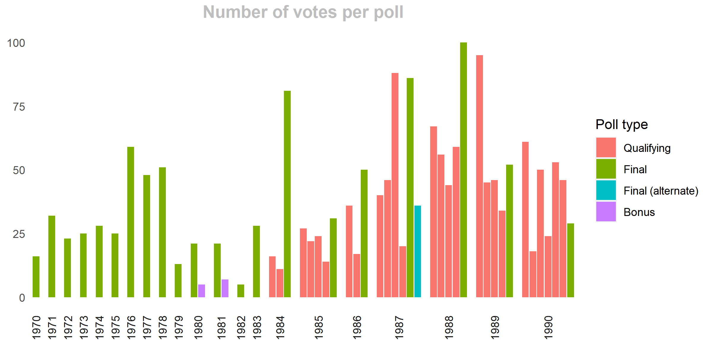
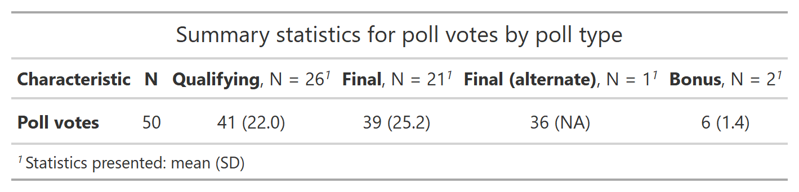
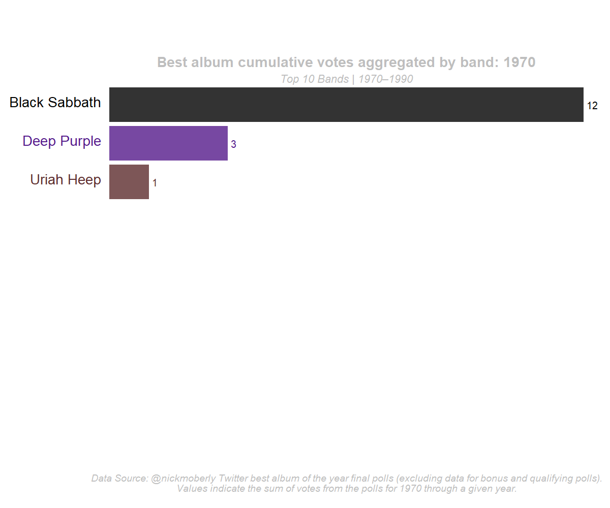

------------------------------------------------------------------------

output: github_document

------------------------------------------------------------------------

<!-- README.md is generated from README.Rmd. Please edit that file -->

 

# rockr 

<!-- badges: start -->
<!-- badges: end -->

The (current) goal of `rockr` is to identify top ranked bands from
polling data on best album of the year. Given a series of Twitter polls
on best album of the year, with sequential polls for each year, where
some bands are reoccurring response options across polls, we

1.  Munge data into an analysis-ready format

2.  Produce multiple scalings and subsets of data to permit different
    ways of conceptualising poll results

3.  Render animated bar charts to visualise the cumulative and aggregate
    response across the series of polls

 

> (Attempts at) British spelling are in honour of *Nick Moberly*
> (Exeter, UK), whose @nickmoberly Twitter polls were the motivation for
> and contributing data used in the illustrative example.

 

## Packages, script, and data

Although `rockr` aspires to be a full blown package contributing an
array of functions and analytic enhancements useful for a variety of
applications, at present it is simply a code and data repository, with a
script to perform one task, tailored to one particular dataset. See
section, [Future development of
`rockr`](#Future%20development%20of%20rockr), for thoughts on what
`rockr` might be when it grows up.

The analyses described herein requires the installation and loading of
the following `R` packages:

`tidyverse`, `gt`, `gtsummary`, `install_phantomjs`, `ggplot2`,
`gganimate`, `png`

All `R` code required for this project can be found in
[R/twitter_api_poll_call.Rmd](https://github.com/MarkLaVenia/rockr/blob/master/R/twitter_api_poll_call.Rmd)
(for calling and cleaning the data) and [R/Animated Bar
Chart.Rmd](https://github.com/MarkLaVenia/rockr/blob/master/R/Animated%20Bar%20Chart.Rmd)
(for analyzing and plotting the data), with raw data found in
[data-raw/raw_twitter_api_poll_data.csv](https://github.com/MarkLaVenia/rockr/tree/master/data-raw/raw_twitter_api_poll_data.csv)

## Analytic premises and assumptions (*…however questionable*)

-   A band’s status within the ranking of best bands is a function of
    -   the number of albums a band has that qualify as one of the best
        albums of the year and
    -   the proportion of people who vote a band’s albums as the best
        album of the year.
-   Poll percentages weighted equally across years smooths over
    variation in response rate across polls;
    -   however, the sum of votes may (in part) be an indicator of
        enthusiasm for a given band or album–and therefore may also be a
        valid metric for ranking bands.
        -   polls for years 1984-1992 attracted more responses than
            earlier and later polls–perhaps signalling the best/most
            interesting era for metal.
-   Constraining the data to only the final poll for each year avoids
    the problem of needing to account for albums that appeared on both
    qualifying and final polls;
    -   however, on the premise that the magnitude of voter response is
        an indicator of enthusiasm for a given band or album, summing
        across bonus, qualifying, and final polls–constituting the total
        sum of votes cast for a band or album given the opportunity to
        vote for that band or album–may yield some insight.
-   Lastly, regarding these polls, it is worth noting that these are not
    scientifically derived samples–just Nick’s Twitter mates :)

## Data preparation

Via access to the [Twitter
API](https://developer.twitter.com/en/products/twitter-api), I used R
programming to query and wrangle the poll data.

Regrettably, I have not devised a function that can call poll fields for
an entire timeline all at once. Therefore, the procedure presented here
required a first step of calling the `conversation_ids` for the entire
timeline. Then, manually updating the Client URL in the code for each
poll. This second step took 30-40 seconds for each call. Suggestions are
welcome on a more elegant solution, such as a `for()loop` or `lapply()`
function that cycles through the ids automatically.

### Analysis file

The [Twitter API poll
object](https://developer.twitter.com/en/docs/twitter-api/data-dictionary/object-model/poll)
contains data on the number of votes per poll response option,
Accordingly, using the `mutate()` command we calculate the percentage of
votes per response option.

### Exploration

The first thing we do is make a quick check for data error red flags.
Using the `group_by()` and `summarise(sum())` commands we calculate the
sum of percentages for each response option for each poll; and using the
`mutate(sprintf())` and `unique()` commands to verify that all polls sum
to 100 percent.

And using the `ggplot()` function, we produce a visualization to inspect
the number of votes per poll. Here we use the `facet_grid()` command to
group the polls for each album year.

We observe a suspiciously low number of votes for the 1982 final poll.
Double-checking Twitter revealed that the 1982 poll indeed did have a
low response rate: shocking given it included bangers such as Maiden’s
*Number of the Beast* and Priest’s *Screaming for Vengeance*, making it
clear that enthusiasm for the bands or albums can in no way explain all
the variation in response rate.

Using the `summarise(n_distinct())` command we see that across all
qualifying and final polls, the data comprise *179* polls covering *247*
bands cumulatively. Constraining to final polls only, the data comprise
*31* polls covering *69* bands cumulatively.

Then, we use the `tbl_summary()` command to view the mean and standard
deviation in poll votes by poll type to make some assessment of the
central tendency and dispersion of responsiveness to the polls.

### Selection

We then reduce the dataframe to the observations of interest.

-   For all analyses, we drop observations for polls coded as invalid.
    -   In the example data, one poll coded as invalid was conducted as
        an alternate final.
-   For two analyses we retain data for only final polls, excluding data
    for bonus and qualifying polls (see [Bar Chart 1](#Bar%20Chart%201)
    and [Bar Chart 2](#Bar%20Chart%202)); for a third analysis we
    retained data for all valid polls, inclusive of bonus, qualifying,
    and final polls (see [Bar Chart 3](#Bar%20Chart%203)).

### Aggregation

To remedy instances where a given band appeared more than once in a
given year

-   we use the `group_by()` and `summarise_at()` commands to sum
    percentages or vote counts for each band per year.
-   This scenario occurred in the 1970 final poll, where *Black Sabbath*
    had two albums that year;
    -   other scenarios for this occur when analyzing bonus, qualifying,
        and final polls jointly.

### Structure

Before undertaking the computations in the next step, we want a file in
a long (tidy) format, with each band having a row for every year in the
dataset regardless of whether the band had poll data for that year.
There is probably a more efficient way of accomplishing this; but short
of figuring that out,

-   I first used the `pivot_wider()` command, followed by the
    `pivot_longer()` command to accomplish this.
-   A more efficient approach might evaluate which years were unobserved
    for given bands, then insert rows for those missing observations.
    -   Suggestions on improved approaches to this are welcome.

### Computation

To calculate rolling averages and sums, we use

-   the `mutate(cummmean())` command with the `poll_percent` variable
    and
-   the `mutate(cummsum())` command with the `album_votes` variable.

### Format

The final step before plotting is to format the data for analysis by
calling

-   the `group_by()` and `mutate(rank())` commands to rank order the
    bands with each year and
-   the `group_by()` and `filter()` commands to constrain the data to
    the top ranked bands for any given year.
    -   In this example we filter to the top 10 ranked bands.

## Rendering animated bar charts

### Static and animated plots

The first step to making an animated bar chart is to plot a series of
static bar charts using the `ggplot()` command.

-   Dissatisfied with the default colors, I create a custom array of
    colors and called it in using the `scale_colour_manual()` and
    `scale_fill_manual()` commands.
    -   After all, *Black Sabbath* has to be *black* and *Deep Purple*
        has to be *purple*, *right*?
-   Using the `unique()` command we can generate the list of bands in
    the plot for which colors are needed.

Then we use the `transition_states()` command to stitch together the
individual static plots.

-   And the final step is rendering the animated plots using the
    `animate(gifski_renderer())` command.   
    

#### Bar Chart 1. *Best album cumulative percentage of votes aggregated by band*

This plot uses a rolling average of the `poll_percent` variable as the
plotted metric, based on results according to the *final* polls.

    

#### Bar Chart 2. *Best album cumulative votes aggregated by band*

This plot uses a rolling sum of the `album_votes` variable as the
plotted metric, based on results according to the *final* polls.

-   This and the following plot that uses vote sums as the plotted
    metric has the annoying quirk of occasionally having ties where bars
    overlap–making the band name difficult to read.
    -   Suggested visualization remedies to the overlapping of bars are
        welcome.
        

        
        

            

#### Bar Chart 3. *Best album cumulative votes aggregated by band*

This plot uses a rolling sum of the `album_votes` variable as the
plotted metric, based on results according to *all* polls.

 

------------------------------------------------------------------------

### Source code and guidance

> Credit to [AbdulMajedRaja
> RS](https://towardsdatascience.com/create-animated-bar-charts-using-r-31d09e5841da)
> for source code and guidance referenced for these animated bar charts.
> See also related [Stack Overflow
> posts](https://stackoverflow.com/questions/53162821/animated-sorted-bar-chart-with-bars-overtaking-each-other)
> for guidance and discussion.

------------------------------------------------------------------------

  

### Future development of `rockr`

1.  The most intuitive next step in development of `rockr` is to improve
    the method of calling poll fields from the Twitter API.

2.  The exercise of deploying Twitter polls on album of the year derived
    from Nick’s (@NickMoberly) desire to fill gaps in knowledge on the
    prominent hard rock and metal bands over the decades. Accordingly,
    an enhancement to the function of `rockr` could be to integrate data
    that could be drawn upon for the purpose of informing the
    development of new polls and survey instruments.

    -   The [Metal Archives: Encyclopdaedia
        Metallum](https://www.metal-archives.com/) is an extensive data
        repository on metal bands with information on home country,
        sub-genre, band members past and present, discography, related
        artists, etc.
        -   [JarbasAI’s Metal
            Dataset](https://github.com/OpenJarbas/metal_dataset) is an
            already conducted scraping of [Metal
            Archives](https://www.metal-archives.com/), though limited
            to only data on band names, song titles, and lyrics sorted
            by sub-genre. Incorporating these data would be an easy
            lift, though additional scraping of [Metal
            Archives](https://www.metal-archives.com/) would be required
            to obtain data on discography, related artists, etc.
        -   Then, using reactive programming, such as through `R`’s
            `Shiny` package, a dynamic user interface could be developed
            that draws upon the stores of data to generate lists of
            similar sets of bands or albums based on selected inputs.
            -   In addition to facilitating poll development, the
                exercise of interacting with a `rockr` interface of this
                kind could in itself be a generative exercise for one’s
                own exploration.
                -   Some of this functionality can already be
                    accomplished through the many music streaming
                    services available, except the UI described here
                    would/could be more comprehensive in its
                    directories, unimpeded by the various constraints
                    with which those services contend around access and
                    use.

3.  Additional data that might be incorporated include archives of
    rankings according to rock and metal ’zine charts and reviews,
    including those from prominent outlets like *Kerrang!* and *Metal
    Hammer*, as well as smaller independent outlets and fanzines. [Cult
    Never
    Dies](https://cultneverdies.myshopify.com/collections/books-zines),
    [The Corroseum](https://thecorroseum.org/fanzines/index.php), [Rare
    & Obscure
    Metal](https://strappadometalblog.blogspot.com/2011/02/zine-zone-metal-fanzines.html)
    and [Send Back My
    Stamps!](https://sendbackmystamps.org/fanzine-pdf-downloads/) are
    example webstores and repositories of metal fanzines that might be
    drawn upon, not to mention university archives that could be
    accessed.

    -   An extraordinarily ambitious undertaking might be to even
        incorporate text from interviews and articles published in such
        sources. The opportunities for textual analysis from such a data
        repository would be tremendous.
    -   A data repository of this kind would constitute a robust basis
        for clustering bands according to style and influence. Analytic
        approaches such as latent transition analyses and machine
        learning techniques could be leveraged to group bands by
        profile, allowing profile to vary over time according to
        observed indicators for albums.

4.  Further, `spotifyr`, a `R` wrapper for Spotify’s [Web
    API](https://developer.spotify.com/documentation/web-api/), can be
    used to gain access to not only information on artists, albums,
    tracks, etc., but also attributes for each song such as tempo,
    energy, key, etc.

    -   In addition to existing data on attributes of songs, original
        analysis of music can be conducted through tools such as the
        `tuneR` R package. The opportunities for engaging in the
        analysis of [textural, sonic, and musical
        components](https://joelezekielconfetti.wordpress.com) in the
        service of building a robust ontology of rock sub-genres is
        truly awe-inspiring.

5.  The [Bound by Metal - Interactive Metal Genres
    Graph](https://www.boundbymetal.com/en/common/metal-genres-graph)
    represents an excellent data visualization for up- and down-stream
    influences between sub-genres. This kind of network analysis can be
    useful for interrogating the ontology of and relationships between
    sub-genres.

    -   However, I would love greater transparency around the source
        data and decision rules. Also, I’d love to be able toggle the
        unit of analysis to visualize the network connections by band–or
        even account for and visualize how bands may vary in style over
        time, evolving across sub-genres.
        -   A `rockr` package might be designed to do just that. Use of
            network graphing to explore established relationships and
            plot analyses probing proposed relationships can make
            `rockr` a useful tool for learning and presenting.

6.  [Alberto Acerbi’s genre
    analysis](https://github.com/albertoacerbi/mxm_genres_analysis)
    constitutes an interesting sentiment analysis of lyrics, which
    infers the positive and negative emotional tone of music, by genre,
    and over time. Certainly other conceptual frameworks and dimension
    operationalizations could be applied to explore alternate
    interpretations of the data. Albert Acerbi makes use of the
    [musixmatch](https://www.musixmatch.com/) repository of song lyrics
    for his analysis, which could be drawn upon for replication and
    extension of this line of inquiry.

    -   One variation on this analytic strategy includes taking a more
        holistic approach to categorizing positive and negative
        emotional tone, such as keying by word phrases rather than
        individual words–or even clustering lyrics by song to allow for
        an evaluation of individual songs over the entire arc of their
        lyrics.
        -   Going further, incorporating data on the attributes of the
            music itself might allow for a multidimensional framework
            that explains how an overall positive emotional tone can
            occur for a song with ostensibly negative lyrics. It seems
            textural, sonic, and musical components may be an important
            factor to include when trying to understand the effect of
            music on the listener.
        -   A repository of this kind could be a valuabe resource for
            researchers studying the social psychology of music,
            including inter-individual differences in aesthetic
            sensativity.  

#### On a `rockrverse` collection of `R` packages

If a robust data warehouse could be assembled as described above for a
`rockr` package, the vast array of analytic and visualization
opportunities provokes the call for a meta-package: a `rockrverse`.

-   Other functions that might be combined into this suite of packages
    include the `tabr` package for rendering tablature and sheet music
    for guitar and other stringed instruments. This is certainly outside
    the lane of what put the `rockr` project in motion; nevertheless, it
    is a parallel-running interest that many users of `rockr` will
    surely appreciate being integrated.

-   Corresponding projects with JarbasAI’s [Metal
    Dataset](https://github.com/OpenJarbas/metal_dataset) are [Metal
    Generator](https://ai-jarbas.gitbook.io/jarbasai/projects/metal-generator)
    / [pymetal](https://github.com/OpenJarbas/pymetal), a`Python`
    package for generating new band names, song names, and lyrics.

    -   Again, this function is not integral to what we set out to
        accomplish with a `rockr` package. Nevertheless, within the
        suite of `rockrverse` packages might live an `R` cousin of
        `pymetal`: `rmetal`, if you will. I’d venture that those
        interested in using a `rockr` package would appreciate having a
        `rmetal` functionality that is easily available–either for
        manifest purposes or just for kicks.

-   There are a number of us in the academic/research world who at one
    time played in or currently do play in bands that are in the
    registries of [Metal Archives](https://www.metal-archives.com/). It
    has been half-joked that it would be great if someone could figure
    out how to link metal-archives with [ORCID](https://orcid.org/), to
    facilitate a comprehensive incorporation of our professional
    activity and published works. On this thought, I propose the
    development of `metalORCID`: an `R` package for integrating
    metal-archives with ORCID.

    -   Already, [ORCID](https://orcid.org/) integrates with other
        applications like Scopus and Publons and there is an [ORCID
        Developer Tool](https://orcid.org/developer-tools) that appears
        like it would support the development of a `metalORCID`
        integration. Thus, this doesn’t look like an outlandish
        proposition.

The ideas generated above are only a sample of developments that might
be pursued in associations with a `rockr` package.  

> Consider this as an open invitation for all collaborators interested
> in pursuing any of these or other development ideas for a prospective
> `rockr`/`rockrverse` package.

  [top of page](#top%20of%20page)   

------------------------------------------------------------------------

 

   
